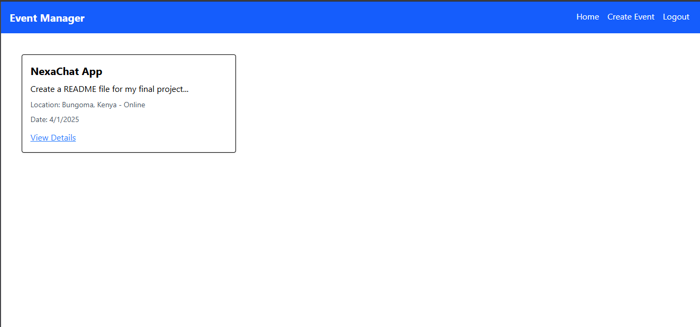

# Event Manager

A full-stack web application for managing events, built with React and Node.js.

## Features

- User authentication and authorization
- Event creation and management
- Event registration and attendance tracking
- Responsive design with modern UI
- Real-time updates

## Tech Stack

### Frontend
- React 19
- Vite
- TailwindCSS
- React Router DOM
- Axios for API calls

### Backend
- Node.js
- Express.js
- MongoDB with Mongoose
- JWT for authentication
- Bcrypt for password hashing

## Getting Started

### Prerequisites
- Node.js (v14 or higher)
- MongoDB
- npm or yarn

### Installation

1. Clone the repository
```bash
git clone https://github.com/wekesaoliver/event-manager.git
cd event-manager
```

2. Install Frontend Dependencies
```bash
cd frontend
npm install
```

3. Install Backend Dependencies
```bash
cd ../backend
npm install
```

4. Environment Setup
Create a `.env` file in the backend directory with the following variables:
```
PORT=5000
MONGODB_URI=your_mongodb_connection_string
JWT_SECRET=your_jwt_secret
```

### Running the Application

1. Start the Backend Server
```bash
cd backend
npm run dev
```

2. Start the Frontend Development Server
```bash
cd frontend
npm run dev
```

The application will be available at `http://localhost:5173`

## Deployment
Backend (Render)
Frontend (Vercel)
Backend Workflow: automatically triggers build, lint, test and deploy to Render

The application is deployed at https://event-manager-lovat-gamma.vercel.app/



## Contributing

1. Fork the repository
2. Create your feature branch (`git checkout -b feature/AmazingFeature`)
3. Commit your changes (`git commit -m 'Add some AmazingFeature'`)
4. Push to the branch (`git push origin feature/AmazingFeature`)
5. Open a Pull Request

## License

This project is licensed under the ISC License - see the LICENSE file for details.

Project Link: [https://github.com/wekesaoliver/event-manager](https://github.com/wekesaoliver/event-manager)
